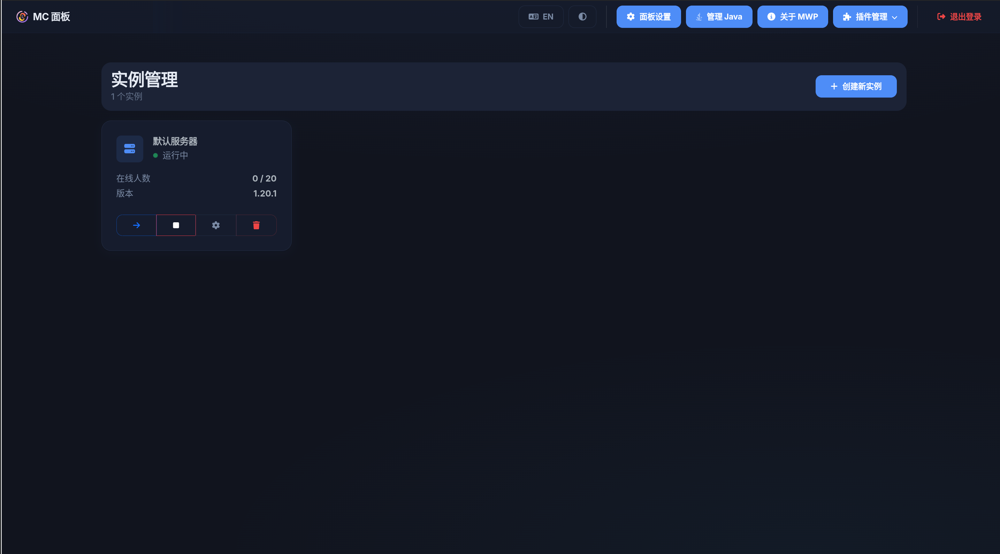
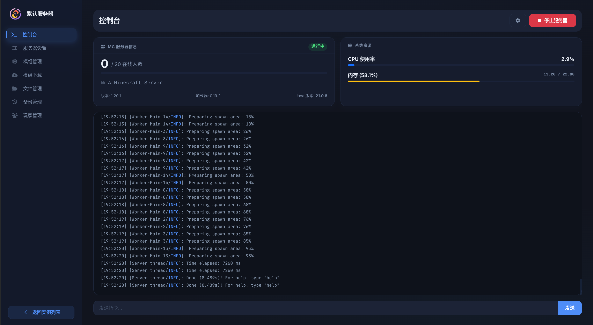

<div align="center">

# 🎮 MC Web Panel

[](https://github.com/your-username/mc-web-panel/stargazers)
[](https://github.com/your-username/mc-web-panel/network/members)
[](https://github.com/your-username/mc-web-panel/blob/main/LICENSE)
[](https://github.com/your-username/mc-web-panel/releases)
[](https://github.com/your-username/mc-web-panel/issues)

一个轻量级、现代化且高性能的 Minecraft 服务器管理面板

[English](#english) | [中文](#chinese)

</div>

---

<a name="chinese"></a>
## 🇨🇳 中文

### ✨ 项目简介

MC Web Panel 是一个基于 **Node.js** 和 **Vue 3** 构建的现代化 Minecraft 服务器管理面板。它提供了美观的 Web 界面，让您轻松管理 Fabric 服务器、玩家、文件等。

无论是个人服务器还是小型社区，MC Web Panel 都能为您提供专业的管理体验！

### 📸 截图展示

| 实例列表 | 实例详情 |
|---------|---------|
|  |  |

### 🚀 核心特性

| 特性 | 描述 |
|-----|-----|
| 📊 **实时监控** | 实时查看服务器状态、CPU/内存使用率和控制台输出 |
| 📁 **文件管理** | 支持在线上传、下载、编辑和解压文件 |
| 🔧 **侧边栏自定义** | 拖拽排序和显示/隐藏侧边栏项目 |
| 🎮 **Modrinth 浏览器** | 集成 Modrinth 搜索，一键安装模组 |
| 🌐 **内网穿透** | 内置 FRP 管理，轻松实现公网访问 |
| 👥 **玩家管理** | 管理白名单、OP、黑名单，以及踢出/封禁/传送在线玩家 |
| 🎨 **外观自定义** | 个性化主题设置，支持自定义背景图、模糊度及透明度 |
| 📱 **响应式设计** | 针对移动端和桌面端深度优化的 UI/UX 体验 |
| 💾 **备份管理** | 强大的备份还原系统（支持快照和增量备份） |
| 🔒 **安全** | 支持 2FA (Google 身份验证器) 双重验证 |
| 💻 **多平台支持** | 支持 Linux (x64/ARM64) 和 Windows (x64) |
| 🔌 **插件系统** | 模块化架构，支持开发者轻松扩展后端逻辑与前端 UI |

### 🎯 为什么选择 MC Web Panel？

1. **轻量高效** - 占用资源少，启动速度快
2. **简单易用** - 直观的界面设计，上手零门槛
3. **功能全面** - 涵盖服务器管理的方方面面
4. **持续更新** - 活跃的开发社区，功能不断迭代
5. **开源免费** - 完全开源，自由使用和修改

### 📦 支持的模组与插件

本面板为以下功能提供了专属的图形化管理界面：

- **FRP 内网穿透** - 内置的内网穿透管理器
- **Easy Auth (简单认证)** - 管理已注册用户、修改密码和注销用户
- **Advanced Backup (高级备份)** - 创建和还原备份（支持快照和增量备份）
- **Simple Voice Chat (简单语音聊天)** - 直接在面板中配置语音聊天设置

### 🛠️ 快速开始

#### 方式一：使用可执行文件（推荐）

1. 从 [Releases](https://github.com/your-username/mc-web-panel/releases) 页面下载对应平台的执行文件
2. 将其放置在一个空目录中（推荐）
3. 运行可执行文件：
   - **Linux**: `./mc-web-panel-linux-x64 start`
   - **Windows**: 双击 `mc-web-panel-win-x64.exe`
4. 打开浏览器访问 `http://localhost:3000`
5. 跟随设置向导安装新的 Minecraft 服务器，或指定现有的服务端 JAR 文件

#### 方式二：从源码运行

如果您希望从源码运行面板（需要 Node.js 18+）：

```bash
# 1. 克隆仓库
git clone https://github.com/your-username/mc-web-panel.git
cd mc-web-panel

# 2. 安装依赖
npm install

# 3. 启动服务器
npm run start

# 4. (可选) 构建可执行文件
npm run build
```

### 💻 命令行管理

| 命令 | 说明 |
|---|---|
| `start` | 启动面板（后台运行，默认行为） |
| `stop` | 停止面板 |
| `restart` | 重启面板 |
| `host <端口>` | 修改面板端口（如 `host 3001`） |
| `reset` | 重置 2FA 密钥并打印新密钥 |
| `help` | 显示帮助信息 |

**使用示例：**

```bash
./mc-web-panel-linux-x64 start       # 后台启动面板
./mc-web-panel-linux-x64 stop        # 停止面板
./mc-web-panel-linux-x64 restart     # 重启面板
./mc-web-panel-linux-x64 host 8080   # 将端口改为 8080
./mc-web-panel-linux-x64 reset       # 重置 2FA 密钥
```

### 🤝 贡献指南

我们欢迎任何形式的贡献！包括但不限于：

- 提交 Bug 报告
- 提出新功能建议
- 提交代码改进
- 完善文档

请先阅读 [CONTRIBUTING.md](./CONTRIBUTING.md)（如果有）了解详细的贡献流程。

### 📄 许可证

本项目采用 [MIT License](./LICENSE) 许可证。

---

<a name="english"></a>
## 🇺🇸 English

### ✨ Introduction

MC Web Panel is a lightweight, modern, and high-performance Minecraft server management panel built with **Node.js** and **Vue 3**. It provides a beautiful web interface to manage your Fabric server, players, files, and more.

Whether it's a personal server or a small community, MC Web Panel can provide you with a professional management experience!

### 📸 Screenshots

| Instance List | Instance Details |
|---------------|------------------|
|  |  |

### 🚀 Key Features

| Feature | Description |
|---------|-------------|
| 📊 **Dashboard** | Real-time server status, CPU/RAM usage, and console output |
| 📁 **File Manager** | Web-based file management with upload, download, edit, and unzip capabilities |
| 🔧 **Customizable Sidebar** | Drag-and-drop to reorder sidebar items and toggle visibility |
| 🎮 **Modrinth Browser** | Search and download mods directly from Modrinth with one-click installation |
| 🌐 **Intranet Penetration** | Built-in FRP management for easy public access |
| 👥 **Player Manager** | Manage whitelist, OPs, bans, and kick/ban/teleport online players |
| 🎨 **Appearance Customization** | Personalized themes with custom background images, blur, and transparency settings |
| 📱 **Responsive Design** | Optimized UI/UX for both desktop and mobile devices |
| 💾 **Backup Management** | Powerful backup and restore system (supports snapshots and incremental backups) |
| 🔒 **Security** | 2FA (Google Authenticator) support |
| 💻 **Multi-Platform** | Runs on Linux (x64/ARM64) and Windows (x64) |
| 🔌 **Plugin System** | Modular architecture allowing developers to extend backend logic and frontend UI easily |

### 🎯 Why Choose MC Web Panel?

1. **Lightweight & Efficient** - Low resource consumption, fast startup
2. **Easy to Use** - Intuitive interface design, zero learning curve
3. **Comprehensive Features** - Covers all aspects of server management
4. **Continuous Updates** - Active development community, features constantly iterating
5. **Open Source & Free** - Completely open source, free to use and modify

### 📦 Supported Mods & Plugins

This panel features dedicated GUI integration for:

- **FRP**: Built-in intranet penetration manager
- **Easy Auth**: Manage registered users, change passwords, and unregister users
- **Advanced Backup**: Create and restore backups (snapshots/differential)
- **Simple Voice Chat**: Configure voice chat settings directly from the panel

### 🛠️ Quick Start

#### Method 1: Using Executable (Recommended)

1. Download the executable for your platform from the [Releases](https://github.com/your-username/mc-web-panel/releases) page
2. Place it in an empty directory (recommended)
3. Run the executable:
   - **Linux**: `./mc-web-panel-linux-x64 start`
   - **Windows**: Double-click `mc-web-panel-win-x64.exe`
4. Open your browser and visit `http://localhost:3000`
5. Follow the setup wizard to install a Minecraft server or point it to your existing server jar

#### Method 2: Run from Source

If you prefer to run the panel from source code (requires Node.js 18+):

```bash
# 1. Clone the repository
git clone https://github.com/your-username/mc-web-panel.git
cd mc-web-panel

# 2. Install dependencies
npm install

# 3. Start the server
npm run start

# 4. (Optional) Build the executable
npm run build
```

### 💻 CLI Commands

| Command | Description |
|---|---|
| `start` | Start the panel (runs in background, default) |
| `stop` | Stop the panel |
| `restart` | Restart the panel |
| `host <port>` | Change the panel port (e.g., `host 3001`) |
| `reset` | Reset the 2FA key and print the new secret |
| `help` | Show help information |

**Examples:**

```bash
./mc-web-panel-linux-x64 start       # Start panel in background
./mc-web-panel-linux-x64 stop        # Stop panel
./mc-web-panel-linux-x64 restart     # Restart panel
./mc-web-panel-linux-x64 host 8080   # Change port to 8080
./mc-web-panel-linux-x64 reset       # Reset 2FA credentials
```

### 🤝 Contributing

We welcome any form of contribution! Including but not limited to:

- Submitting bug reports
- Proposing new features
- Submitting code improvements
- Improving documentation

Please read [CONTRIBUTING.md](./CONTRIBUTING.md) (if available) for detailed contribution guidelines.

### 📄 License

This project is licensed under the [MIT License](./LICENSE).

---

<div align="center">

Made with ❤️ by [your-username](https://github.com/your-username)

</div>
